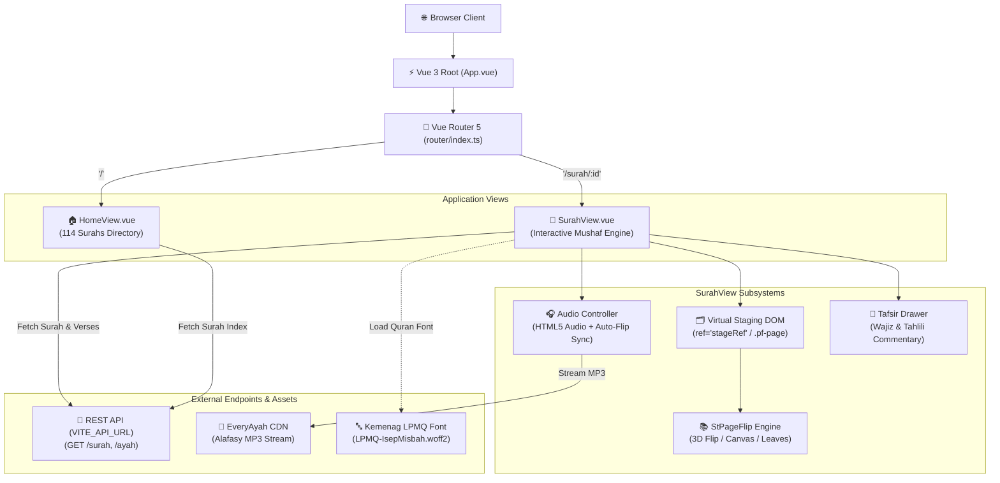
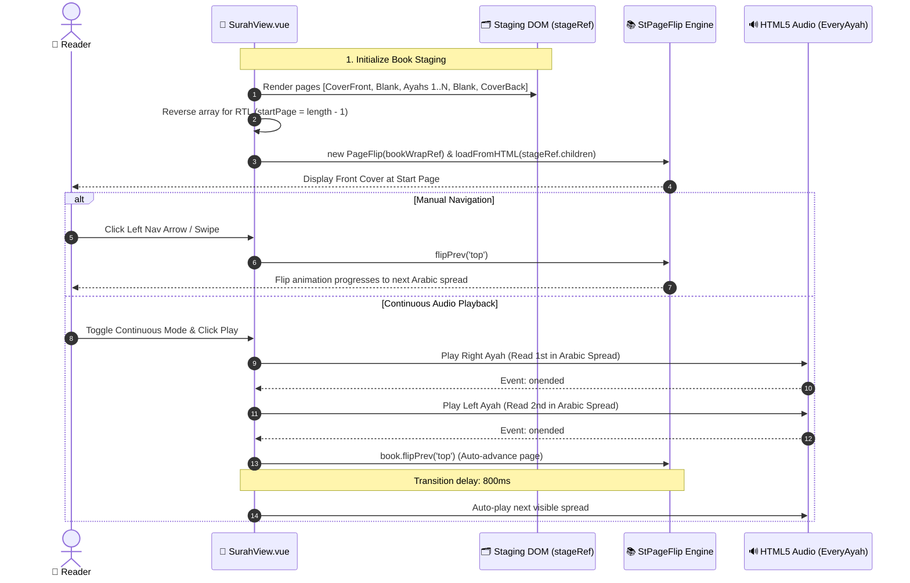

# 🤖 AGENTS.md — Agent & AI Developer Context Guide

Welcome, AI Agent! This document contains the complete context, architectural patterns, domain quirks, critical rules, and command guides needed to effectively develop, refactor, and maintain the **MyQuran Frontend** codebase.

---

## 🧭 1. Executive Summary & Project Purpose

**MyQuran** is an interactive, browser-based digital Al-Qur'an reader that recreates the authentic physical *Mushaf* reading experience without requiring installation.

### Key Value Propositions:
- **Realistic Page-Turning Physics**: Mimics a physical Quran with spine depth, hard covers, paper shadows, and page-turning animations via `page-flip`.
- **RTL Quranic Reading Flow**: Custom right-to-left layout and page inversion so readers turn pages naturally as with a real Arabic Mushaf.
- **Synchronized Multimodal Recitation**: Audio recitation with multi-qari selection (Alafasy, Sudais, Ghamdi, Husary), playback rate control, automated spread progression, and dual-layer Tafsir (*Wajiz* & *Tahlili*).

---

## 🛠️ 2. Tech Stack & Environment

| Component         | Technology                       | Agent Rules & Conventions                                                                        |
| :---------------- | :------------------------------- | :----------------------------------------------------------------------------------------------- |
| **Framework**     | **Vue 3** (Composition API)      | **Always** use `<script setup lang="ts">`. Never use Options API.                                |
| **Language**      | **TypeScript 5.9+**              | Strict types. Run `vue-tsc -b` to verify types before submitting changes.                        |
| **Runtime & PM**  | **Bun** (`oven/bun:1`)           | Prefer `bun` / `bun run` over `npm` for speed and consistency with `bun.lock`.                   |
| **Bundler**       | **Vite 8**                       | Aliases configured: `@` -> `/src`.                                                               |
| **CSS Engine**    | **Tailwind CSS v4**              | Uses `@tailwindcss/vite` and `@theme inline` in `src/style.css`. No legacy `tailwind.config.js`. |
| **Color Spaces**  | **OKLCH**                        | Semantic variables (`--background`, `--foreground`, `--card`, `--primary`, `--border`, etc.).    |
| **UI Primitives** | **Reka UI** + Shadcn-Vue pattern | Located in `src/components/ui/`. Unstyled accessible primitives styled with Tailwind.            |
| **Icons**         | **Lucide Vue Next**              | Import from `lucide-vue-next` (e.g. `Play`, `Pause`, `BookOpen`, `ChevronLeft`, `Moon`, `Sun`).  |
| **Book Engine**   | **`page-flip`** (`st-page-flip`) | Staging container required. DOM cloned by library.                                               |
| **Telemetry**     | **`@sentry/vue`**                | Initialized in `src/main.ts`.                                                                    |

### 📐 High-Level Architecture Diagram




---

## 🗂️ 3. Project Directory Map

```text
myQuran-frontend/
├── public/
│   ├── favicon.svg              # App icon
│   ├── icons.svg                # SVG sprite assets
│   └── fonts/
│       └── LPMQ-IsepMisbah.woff2 # Official Kemenag Quran font (CRITICAL)
├── src/
│   ├── assets/                  # Images and static graphics
│   ├── components/
│   │   ├── ui/                  # Reusable Shadcn/Reka UI primitives (Button, Card, Tooltip, Dropdown)
│   │   ├── AppFooter.vue        # Footer credit
│   │   ├── AudioControlBar.vue  # Reusable audio bar component
│   │   ├── AyahPage.vue         # Single ayah presentation component
│   │   ├── ModeToggle.vue       # Theme switcher component
│   │   └── Navbar.vue           # Global navigation with brand, about modal, theme toggle
│   ├── composables/
│   │   └── useDarkMode.ts       # Global dark/light mode state composable with localStorage sync
│   ├── lib/
│   │   └── utils.ts             # Tailwind class merge helper: cn(...inputs)
│   ├── router/
│   │   └── index.ts             # Routes: '/', '/surah/:id', '/hadith', '/hadith/:book', '/hadith/:book/book', '/hadith/:book/:number'
│   ├── views/
│   │   ├── HomeView.vue         # 114 Surah directory & search grid
│   │   ├── SurahView.vue        # Core reader engine (PageFlip, audio sync, Tafsir drawer, Nav sidebar)
│   │   └── hadith/              # Hadith views (catalog, list, 3D Mushaf book mode, detail)
│   ├── App.vue                  # Root layout: Navbar + flex RouterView
│   ├── main.ts                  # App entry point, Sentry initialization, router mount
│   ├── page-flip.d.ts           # Type declaration stub for 'page-flip'
│   └── style.css                # Global styles, @import tailwindcss, font-face, OKLCH variables
├── .env.example                 # Environment template
├── components.json              # Shadcn-Vue config
├── Dockerfile                   # Bun 1-based container definition
├── package.json                 # Dependencies & scripts
├── tsconfig.json                # TS config root
├── vercel.json                  # Deployment configuration & API proxy rewrite
└── vite.config.ts               # Vite configuration with @ alias and Tailwind plugin
```

---

## ⚡ 4. Critical Architecture Patterns & Domain Quirks

### A. The RTL Book-Flip Simulation (`src/views/SurahView.vue`)
> **🚨 DO NOT BREAK THIS PATTERN:**
> 1. `page-flip` is an external canvas/DOM engine that is inherently LTR.
> 2. To simulate an authentic Right-to-Left Arabic Quran:
>    - `bookPages` computed array generates logical pages (`cover-front`, `front-blank`, `ayah-1...N`, `padding-blank`, `back-blank`, `cover-back`).
>    - For Arabic Quran reading, `bookPages` is **reversed** (`pages.push(...logicPages.reverse())`).
>    - The initial active page is set to `startPage = bookPages.value.length - 1` (which represents the visual front cover).
>    - Flipping **forward** through the Surah is executed by calling `book.flipPrev('top')`!
>    - Flipping **backward** is executed by calling `book.flipNext('top')`!
> 3. **Virtual DOM Staging**:
>    `PageFlip` cannot read from Vue's virtual DOM directly after dynamic updates. It reads from an off-screen staging DOM `<div ref="stageRef" style="position:absolute;left:-9999px;">`. When modifying the page markup or styling, ensure `.pf-page` classes and attributes inside `stageRef` remain intact.

### B. Responsive Spread Modes
- **Mobile (< 768px)**: Single-page portrait mode (`isPortrait.value = true`). `pageW = containerW`.
- **Desktop (≥ 768px)**: Two-page spread mode (`isPortrait.value = false`). `pageW = containerW / 2`.
- Window resize events are debounced by 250ms and destroy/rebuild the `PageFlip` instance if breakpoint changes.

### C. Audio Recitation & Page-Turn Lifecycle Sequence



- Audio source is fetched from EveryAyah CDN:
  ```text
  https://everyayah.com/data/Alafasy_128kbps/${String(surahId).padStart(3, '0')}${String(ayahNumber).padStart(3, '0')}.mp3
  ```
- **Spread Playback Strategy (`playSpread`)**:
  - In two-page mode: queues the right visible ayah (which is read first in Arabic), then the left visible ayah.
  - On spread completion (`audioEl.onended`), if `isContinuous` is enabled, it automatically triggers page turning (`flipPrev` for RTL) and queues the next spread after an 800ms transition timeout.


### D. Typography & Arabic Font Rules
- Indonesian Quran standard requires the **`LPMQ Isep Misbah`** font.
- CSS classes to use: `.arabic-text` or `.font-arabic`.
- Always ensure `direction: rtl;` and `text-align: right;` are present on Arabic text elements.
- Never use generic non-Quranic Arabic fonts if possible, as Quranic harakat (tashkeel/sukoon/waslah) can misalign.

### E. Theming & Dark Mode
- Managed through [`src/composables/useDarkMode.ts`](file:///home/illufoxkusanagi/Documents/myQuran-frontend/src/composables/useDarkMode.ts).
- Toggling modifies `document.documentElement.classList` (`dark`) and stores `'dark'` / `'light'` in `localStorage.getItem('theme')`.
- All background colors should use semantic Tailwind tokens like `bg-card`, `bg-background`, `text-foreground`, `text-muted-foreground`, `border-border`.

---

## 📡 5. Backend REST API Schema

The app expects a backend running at `import.meta.env.VITE_API_URL` with these endpoints:

### 1. `GET /surah`
Returns list of all 114 Surahs:
```json
[
  {
    "id": 1,
    "surahName": "Al-Fatihah",
    "arabic": "الفاتحة",
    "numAyah": 7,
    "location": "Makkiyah"
  }
]
```

### 2. `GET /surah/:id`
Returns single Surah metadata:
```json
{
  "id": 1,
  "surahName": "Al-Fatihah",
  "arabic": "الفاتحة",
  "translation": "Pembukaan"
}
```

### 3. `GET /ayah/:id`
Returns array of verses for the given Surah ID:
```json
[
  {
    "id": 1,
    "surahId": 1,
    "ayahNumber": 1,
    "arabic": "بِسْمِ اللَّهِ الرَّحْمَٰنِ الرَّحِيمِ",
    "latin": "Bismillāhir-raḥmānir-raḥīm",
    "translation": "Dengan nama Allah Yang Maha Pengasih, Maha Penyayang.",
    "wajizTafsir": "Tafsir ringkas...",
    "tahliliTafsir": "Tafsir mendalam dan komprehensif...",
    "page": 1,
    "juz": 1
  }
]
```

---

## ⌨️ 6. Common Developer & Agent Commands

```bash
# Install dependencies
bun install

# Start local dev server (default: port 5173, host enabled)
bun run dev

# Run TypeScript typecheck and build for production
bun run build

# Run preview server for built artifacts
bun run preview

# Docker Build & Run
docker build -t myquran-frontend .
docker run -p 5173:5173 -e VITE_API_URL=http://localhost:3000 myquran-frontend
```

---

## 🛡️ 7. Agent Guidelines for Safe Edits

1. **Verify Types After Any Edit**: Always run `bun run build` or `vue-tsc -b` after editing `.vue` or `.ts` files to ensure no TypeScript or template regressions.
2. **Preserve `page-flip` Staging**: Do not delete or inline `.pf-page` template loops without syncing `initPageFlip()` lifecycle.
3. **Avoid Unnecessary Dependencies**: Keep the bundle lean. Use Vue 3 standard reactivity and existing `@vueuse/core` or Lucide icons.
4. **Preserve Sentry & Environment Handlers**: Ensure `VITE_API_URL` fallbacks and Sentry initialization in `src/main.ts` remain functional.
