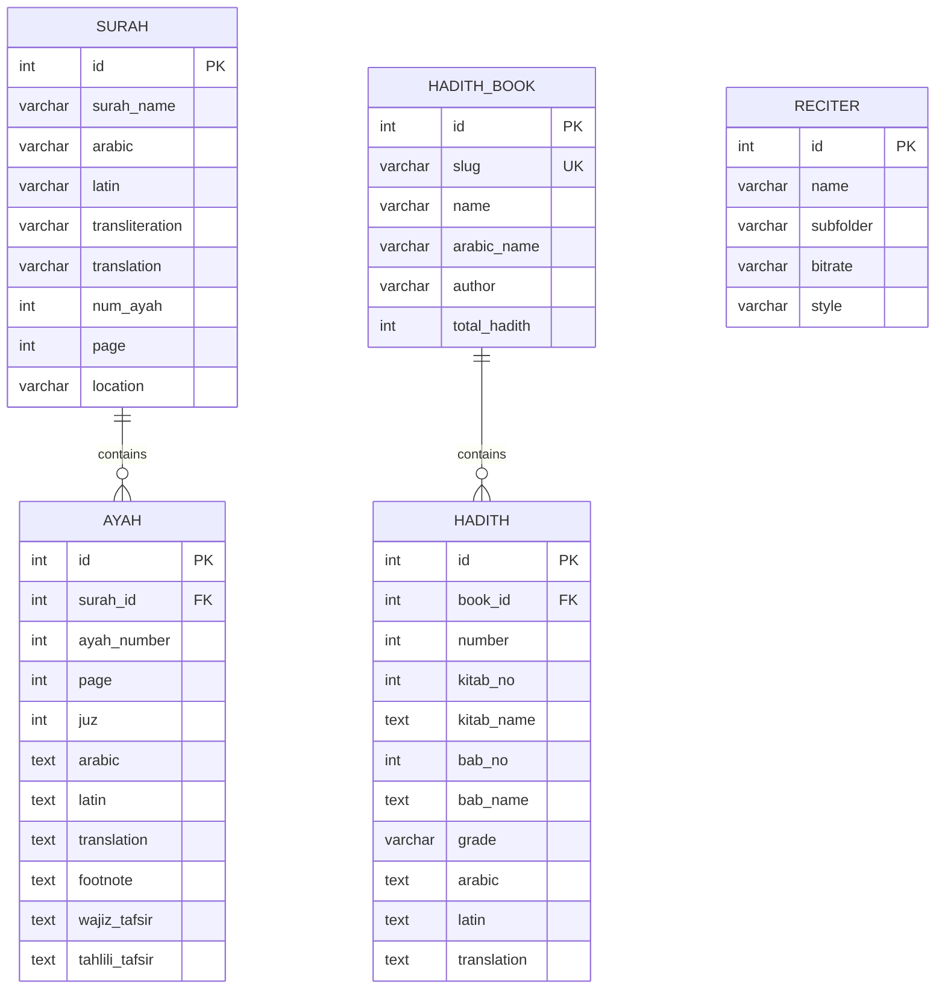

# 📖 myQuran Backend API

A high-performance, self-hosted backend delivering complete **Quranic text, Tafsir, Mushaf page images, Audio recitation streaming, and Hadith collections** built with **Bun**, **Elysia.js**, and **Drizzle ORM** on **PostgreSQL**.

---

## 🌟 Key Features

1. **Complete Quran & Indonesian Tafsir**:
   - All **114 Surahs** and **6,236 Ayahs**.
   - Arabic text (Kemenag standard), Latin transliteration, Indonesian translation, and footnotes.
   - Dual Tafsir: **Tafsir Wajiz** (concise) & **Tafsir Tahlili** (comprehensive).

2. **Mushaf Standar Indonesia Page Images**:
   - All **604 page images** (`QK_001.webp` to `QK_604.webp`) scraped directly from Kemenag CDN.
   - Metadata endpoint (`/page/:pageNumber`) mapping each page to its verses + cached image serving (`/page/:pageNumber/image`).

3. **7 Major Hadith Collections (*Kutubut Tis'ah*)**:
   - **29,187 Hadiths** scraped from `hadits.id` covering Bukhari, Muslim, Abu Dawud, At-Tirmidzi, An-Nasa'i, Ibnu Majah, and Musnad Ahmad.
   - Arabic text, Latin transliteration, Indonesian translation, Kitab & Bab classification, and authenticity grade (*Shahih*, *Hasan*, etc.).
   - Fast paginated browsing, chapter filtering, and "Random Hadith of the Day" support.

4. **Recitation Audio Engine (`everyayah.com`)**:
   - Catalog of 40+ verified Quran reciters (Mishary Al-Afasy, Sudais, Ghamadi, Abdul Basit, Al-Husary, etc.) at 128kbps+.
   - Deterministic audio URLs for both single verse playback and full surah playlists.

5. **Blazing Fast Performance**:
   - Powered by **Bun** and **ElysiaJS** with sub-millisecond route handling.
   - Fully type-safe schemas validated via **TypeBox** and **Drizzle ORM**.

---

## 🛠 Tech Stack

- **Runtime**: [Bun](https://bun.sh)
- **Framework**: [ElysiaJS](https://elysiajs.com)
- **Database**: [PostgreSQL 16](https://www.postgresql.org)
- **ORM**: [Drizzle ORM](https://orm.drizzle.team)
- **Validation**: [TypeBox](https://github.com/sinclairzx81/typebox) via `drizzle-typebox`
- **Containerization**: Docker & Docker Compose

---

## 🚀 Quick Start

### 1. Start Database
```bash
docker compose up -d
```
*PostgreSQL will be running on `localhost:5432` with database `quran_db`.*

### 2. Install Dependencies
```bash
bun install
```

### 3. Push Database Schema
```bash
bun run db:push
```

### 4. Seed Database
```bash
bun run seed
```
*Seeds all 114 Surahs, 6,236 Ayahs (with footnotes & tafsir), 40 Reciters, and 29,187 Hadiths.*

### 5. Start Development Server
```bash
bun run dev
```
The API is live at **`http://localhost:3000`**.

---

## ⚙️ Scraper Commands

All scrapers include automatic rate limiting, retry backoff, and local caching to `data/`:

| Command | Description |
| :--- | :--- |
| `bun run scrape` | Scrape surahs, ayahs, footnotes, and tafsir from Kemenag |
| `bun run scrape:pages` | Scrape all 604 Mushaf WebP page images into `data/pages/` |
| `bun run scrape:hadith --book bukhari` | Scrape specific Hadith collection (e.g. `bukhari`, `muslim`, `abudawud`) |
| `bun run scrape:hadith --all` | Scrape all 7 Hadith collections |
| `bun run seed` | Batch-insert all scraped Quran and Hadith data into PostgreSQL |

---

## 📚 API Reference

Base URL: `http://localhost:3000`

### 1. Surah Endpoints

#### `GET /surah`
List all 114 Surahs with metadata.

**Response `200 OK`**:
```json
[
  {
    "id": 1,
    "surahName": "Al-Fātiḥah",
    "arabic": "الفاتحة",
    "latin": "Al-Fātiḥah",
    "transliteration": "Al-Fatihah",
    "translation": "Pembuka",
    "numAyah": 7,
    "page": 1,
    "location": "Makkiyah",
    "createdAt": "2026-09-02T12:00:00.000Z",
    "updatedAt": "2026-09-02T12:00:00.000Z"
  }
]
```

#### `GET /surah/:id`
Get metadata for a single Surah by ID (1–114).

---

### 2. Ayah & Tafsir Endpoints

#### `GET /ayah/:surahId`
Get all Ayahs for a given Surah (ordered by ayah number), including Arabic, Latin, Translation, Footnote, and Tafsir.

**Response `200 OK`**:
```json
[
  {
    "id": 1,
    "surahId": 1,
    "ayahNumber": 1,
    "page": 1,
    "juz": 1,
    "arabic": "بِسْمِ اللّٰهِ الرَّحْمٰنِ الرَّحِيْمِ",
    "latin": "Bismillāhir-raḥmānir-raḥīm(i).",
    "translation": "Dengan nama Allah Yang Maha Pengasih lagi Maha Penyayang.",
    "footnote": null,
    "wajizTafsir": "Aku memulai bacaan Al-Qur'an dengan menyebut nama Allah...",
    "tahliliTafsir": "Surah al-Fātiḥah dimulai dengan basmalah...",
    "createdAt": "2026-09-02T12:00:00.000Z",
    "updatedAt": "2026-09-02T12:00:00.000Z"
  }
]
```

#### `GET /ayah/:surahId/:ayahNumber/tafsir`
Get concise (*Wajiz*) and in-depth (*Tahlili*) Tafsir for a specific verse.

**Response `200 OK`**:
```json
{
  "surahId": 1,
  "ayahNumber": 1,
  "wajiz": "Aku memulai bacaan Al-Qur'an dengan menyebut nama Allah...",
  "tahlili": "Surah al-Fātiḥah dimulai dengan basmalah..."
}
```

---

### 3. Mushaf Page Endpoints

#### `GET /page/:pageNumber`
Get metadata, list of verses, and image URLs for a Mushaf page (1–604).

**Response `200 OK`**:
```json
{
  "pageNumber": 1,
  "imageUrl": "/page/1/image",
  "kemenagCdnUrl": "https://media.qurankemenag.net/khat2/QK_001.webp",
  "totalVerses": 7,
  "surahs": [
    { "id": 1, "name": "Al-Fātiḥah" }
  ],
  "verses": [
    {
      "id": 1,
      "surahId": 1,
      "surahName": "Al-Fātiḥah",
      "ayahNumber": 1,
      "juz": 1,
      "arabic": "بِسْمِ اللّٰهِ الرَّحْمٰنِ الرَّحِيْمِ",
      "translation": "Dengan nama Allah Yang Maha Pengasih lagi Maha Penyayang."
    }
  ]
}
```

#### `GET /page/:pageNumber/image`
Serves the local high-resolution Mushaf page image (`data/pages/QK_XXX.webp`) or redirects to Kemenag CDN.

---

### 4. Hadith Endpoints

#### `GET /hadith/books`
List all 7 Hadith collections with real-time available counts.

**Response `200 OK`**:
```json
[
  {
    "id": 1,
    "slug": "bukhari",
    "name": "Shahih Al-Bukhari",
    "arabicName": "صحيح البخاري",
    "author": "Imam Bukhari",
    "totalHadith": 7008,
    "availableHadiths": 6986
  },
  {
    "id": 2,
    "slug": "muslim",
    "name": "Shahih Muslim",
    "arabicName": "صحيح مسلم",
    "author": "Imam Muslim",
    "totalHadith": 5362,
    "availableHadiths": 3022
  }
]
```

#### `GET /hadith/:bookSlug`
Paginated list of hadiths within a book.

- **Query Parameters**:
  - `page` *(optional, default: 1)*: Page number
  - `limit` *(optional, default: 20, max: 100)*: Items per page
  - `kitab` *(optional)*: Filter by Kitab / Chapter number (e.g. `?kitab=1`)

**Response `200 OK`**:
```json
{
  "book": {
    "id": 1,
    "slug": "bukhari",
    "name": "Shahih Al-Bukhari",
    "author": "Imam Bukhari"
  },
  "pagination": {
    "page": 1,
    "limit": 20,
    "total": 6986,
    "totalPages": 350,
    "hasNext": true,
    "hasPrev": false
  },
  "hadiths": [
    {
      "id": 1,
      "bookId": 1,
      "number": 1,
      "kitabNo": 1,
      "kitabName": "Kitab Permulaan Wahyu",
      "babNo": 1,
      "babName": "Bab Bagaimana Permulaan Wahyu kepada Rasulullah ﷺ",
      "grade": "Shahih",
      "arabic": "حَدَّثَنَا الْحُمَيْدِيُّ عَبْدُ اللَّهِ بْنُ الزُّبَيْرِ...",
      "latin": "haddatsana alhumaydiyyu abdu allahi ibnu azzubayri...",
      "translation": "Dari Umar bin Al-Khattab: Saya mendengar Rasulullah ﷺ bersabda, \"Sesungguhnya amal itu tergantung pada niat...\""
    }
  ]
}
```

#### `GET /hadith/:bookSlug/:number`
Fetch a single Hadith by its collection slug and number.

**Response `200 OK`**:
```json
{
  "book": {
    "id": 2,
    "slug": "muslim",
    "name": "Shahih Muslim",
    "arabicName": "صحيح مسلم",
    "author": "Imam Muslim"
  },
  "hadith": {
    "id": 6987,
    "number": 1,
    "kitabNo": 1,
    "kitabName": "Mukadimah",
    "babNo": 1,
    "babName": "Bab Peringatan dari Berbohong kepada Rasulullah ﷺ",
    "grade": "Shahih",
    "arabic": "حَدَّثَنَا أَبُو بَكْرِ بْنُ أَبِي شَيْبَةَ...",
    "latin": "haddatsana abu bakri bnu abi syaybata...",
    "translation": "Abu Bakr bin Abi Shaybah meriwayatkan kepada kami bahwa Ghundar meriwayatkan kepada kami..."
  }
}
```

#### `GET /hadith/random`
Fetch a random Hadith (ideal for daily quotes / widget features).

- **Query Parameters**:
  - `book` *(optional)*: Filter by collection slug (e.g. `/hadith/random?book=bukhari`)

---

### 5. Audio & Reciter Endpoints

#### `GET /reciter`
List all 40+ available audio reciters.

**Response `200 OK`**:
```json
[
  {
    "id": 3,
    "name": "Mishary Rashid Al-Afasy",
    "subfolder": "Alafasy_128kbps",
    "bitrate": "128kbps",
    "style": "murattal"
  }
]
```

#### `GET /audio/surah/:surahId`
Get the playlist of verse audio URLs for an entire Surah.

- **Query Parameters**:
  - `reciterId` *(optional, default: 3 - Mishary Alafasy)*

**Response `200 OK`**:
```json
{
  "surahId": 1,
  "reciterId": 3,
  "totalAyahs": 7,
  "audioUrls": [
    "https://everyayah.com/data/Alafasy_128kbps/001001.mp3",
    "https://everyayah.com/data/Alafasy_128kbps/001002.mp3",
    "https://everyayah.com/data/Alafasy_128kbps/001003.mp3"
  ]
}
```

#### `GET /audio/surah/:surahId/:ayahNumber`
Get direct audio URL for a single verse.

---

## 🗄 Database Schema Overview



---

## 📜 Useful Scripts

- `bun run dev` — Start Elysia development server with hot reload
- `bun run db:push` — Sync Drizzle schema changes directly to PostgreSQL
- `bun run db:generate` — Generate SQL migration files
- `bun run db:studio` — Open Drizzle Studio visual web manager
- `bun run seed` — Populate all database tables from local `data/` files
- `bun run scrape` — Scrape Quran text and tafsir
- `bun run scrape:pages` — Scrape Kemenag Mushaf page images
- `bun run scrape:hadith` — Scrape Hadith collections from `hadits.id`

---

## 📄 License

MIT License. Open source and free for non-commercial and educational Islamic applications.
