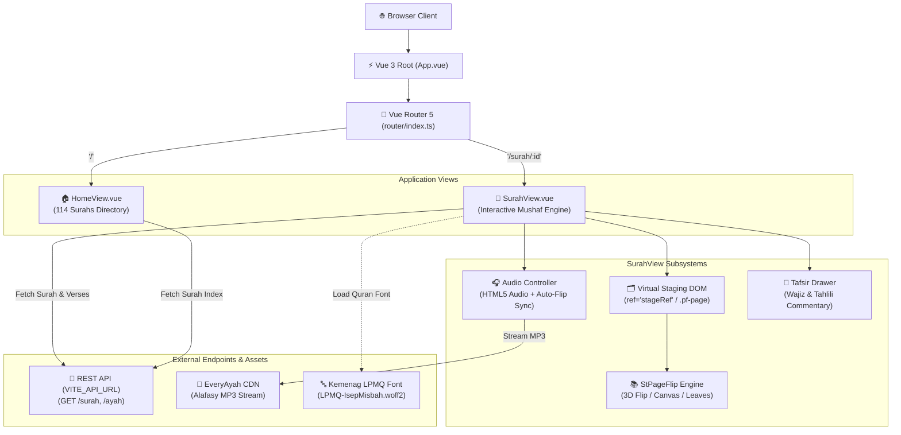
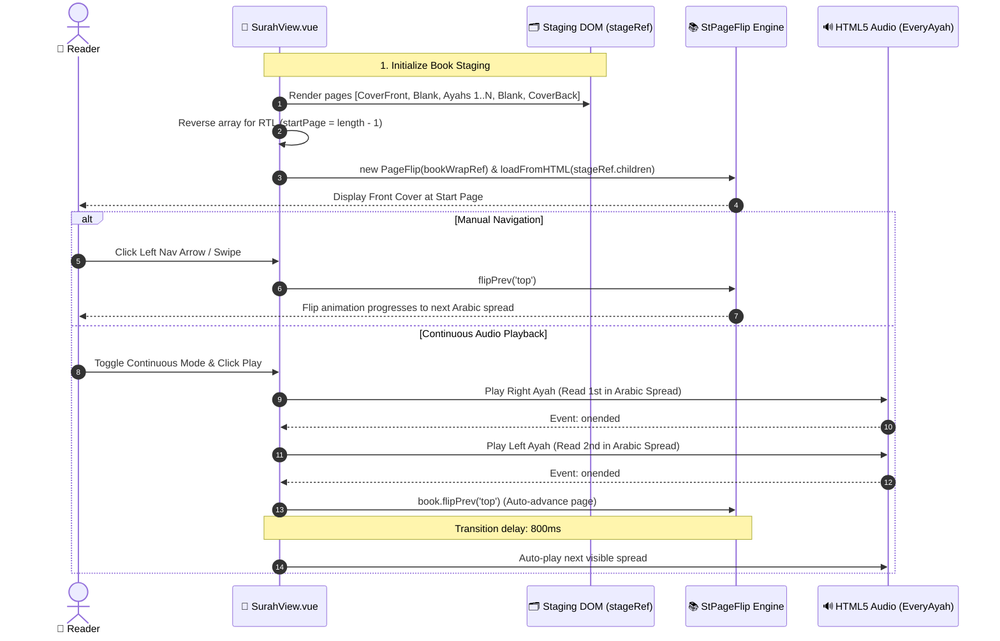

# 📖 MyQuran - Frontend

> **Baca Al-Quran kapan saja, dimana saja, tanpa install.**  
> An interactive, modern, web-based digital Al-Quran reader offering a realistic physical book-reading experience directly in your browser.

---

## 🌟 Overview & Purpose

**MyQuran** is designed to bring the tactile feeling of reading a physical *Mushaf* to the web while integrating modern digital reading tools. Built with **Vue 3**, **TypeScript**, **Tailwind CSS v4**, and **StPageFlip (`page-flip`)**, it bridges traditional Quranic typography with responsive web technology.

### Why this project exists:
- **Authentic Reading Experience**: Simulates a physical Quran with hardcovers, realistic page-turning animations, dual-page spreads on desktop, and single-page views on mobile.
- **RTL Quranic Spread Logic**: Physical Arabic books open from right-to-left. MyQuran models this page progression accurately so readers turn pages naturally.
- **Official Quran Typography**: Uses the Indonesian Ministry of Religious Affairs (*Kemenag*) standard font—**`LPMQ Isep Misbah`**—ensuring accurate Arabic glyphs, harakat, and verse markers.
- **Multimodal Learning**: Complete with verse-by-verse Latin transliteration, Indonesian translations, dual-layer Tafsir (*Wajiz* & *Tahlili*), and synchronized recitation audio by Sheikh Mishary Rashid Alafasy.

---

## ✨ Key Features

| Feature                          | Description                                                                                                                                         |
| :------------------------------- | :-------------------------------------------------------------------------------------------------------------------------------------------------- |
| 📖 **Realistic Book Flip Engine** | Dual-page spread on desktop and single-page on mobile powered by `page-flip`, complete with realistic paper shadows, spine depth, and hard covers.  |
| 🕋 **Surah Directory**            | Browse all 114 Surahs with Arabic titles, English/Indonesian names, Ayah counts, and revelation locations (Makkiyah / Madaniyah).                   |
| 🔤 **Authentic Kemenag Font**     | Embedded `LPMQ Isep Misbah` font tailored specifically for standard Indonesian Quranic script.                                                      |
| 🎧 **Smart Audio Recitation**     | Audio player powered by EveryAyah CDN with **Single Mode** and **Continuous Mode** (automatically turns the page when the spread finishes playing). |
| 📜 **Integrated Tafsir Drawer**   | Slide-up drawer displaying both **Tafsir Wajiz** (concise summary) and **Tafsir Tahlili** (detailed analytical commentary).                         |
| 🌓 **Adaptive Dark Mode**         | Fully custom light/dark theme toggle powered by Tailwind OKLCH color spaces and persisted in `localStorage`.                                        |
| 🛡️ **Error Monitoring**           | Built-in Sentry telemetry for production error catching and performance tracing.                                                                    |

---

## 🛠️ Tech Stack & Architecture

- **Core Framework**: [Vue 3](https://vuejs.org/) (Composition API, `<script setup lang="ts">`)
- **Language**: [TypeScript](https://www.typescriptlang.org/)
- **Bundler & Dev Server**: [Vite 8](https://vitejs.dev/)
- **Runtime & Package Manager**: [Bun](https://bun.sh/) (also compatible with Node.js & npm/pnpm)
- **Styling**: [Tailwind CSS v4](https://tailwindcss.com/) with OKLCH theme tokens and `@tailwindcss/vite`
- **UI Primitives**: [Reka UI](https://reka-ui.com/) & Shadcn-Vue design system conventions
- **Icons**: [Lucide Vue Next](https://lucide.dev/) (`lucide-vue-next`)
- **Book Flipping Engine**: [`page-flip`](https://github.com/Nodlik/StPageFlip)
- **Monitoring**: `@sentry/vue`




---

## 📁 Project Structure

```text
myQuran-frontend/
├── public/
│   ├── favicon.svg             # Application favicon
│   ├── icons.svg               # SVG sprite definitions
│   └── fonts/
│       └── LPMQ-IsepMisbah.woff2 # Official Kemenag Quran font
├── src/
│   ├── assets/                 # Static graphical assets & illustrations
│   ├── components/
│   │   ├── ui/                 # Shadcn/Reka UI atomic components (Button, Card, Tooltip, Dropdown)
│   │   ├── AppFooter.vue       # Persistent footer with creator credits
│   │   ├── AudioControlBar.vue # Standalone bottom audio controller component
│   │   ├── AyahPage.vue        # Dedicated single-page ayah presentation component
│   │   ├── ModeToggle.vue      # Theme switcher button
│   │   └── Navbar.vue          # Top navigation bar with branding, about tooltip, and dark mode toggle
│   ├── composables/
│   │   └── useDarkMode.ts      # Reactive dark mode state composable with localStorage persistence
│   ├── lib/
│   │   └── utils.ts            # Utility functions (cn / clsx / tailwind-merge)
│   ├── router/
│   │   └── index.ts            # Vue Router definitions (HomeView '/' and SurahView '/surah/:id')
│   ├── views/
│   │   ├── HomeView.vue        # Surah listing & directory grid
│   │   └── SurahView.vue       # Interactive book reading engine, audio controller & tafsir drawer
│   ├── App.vue                 # Root application wrapper
│   ├── main.ts                 # Vue application bootstrapping and Sentry initialization
│   ├── page-flip.d.ts          # Type declarations for StPageFlip library
│   └── style.css               # Tailwind v4 imports, OKLCH variables, and custom book styles
├── .env.example                # Sample environment variables
├── components.json             # Shadcn-vue configuration
├── Dockerfile                  # Container definition using Bun 1.x
├── vercel.json                 # Vercel deployment configuration with API proxy rewrites
└── vite.config.ts              # Vite configuration with alias '@' and Tailwind plugin
```

---

## 🔌 API Integration & Data Flow

The frontend consumes REST endpoints from the backend:

### Expected Backend Endpoints:
| Method | Route                        | Description                                                                                                                               |
| :----- | :--------------------------- | :---------------------------------------------------------------------------------------------------------------------------------------- |
| `GET`  | `/surah`                     | Returns an array of all 114 Surahs (`id`, `surahName`, `arabic`, `numAyah`, `location`).                                                  |
| `GET`  | `/surah/:id`                 | Returns metadata for a single Surah (`surahName`, `arabic`, `translation`, etc.).                                                         |
| `GET`  | `/ayah/:id`                  | Returns all Ayahs for the given Surah ID (`ayahNumber`, `arabic`, `latin`, `translation`, `wajizTafsir`, `tahliliTafsir`, `page`, `juz`). |
| `GET`  | `/hadith/books`              | Returns list of available Hadith collections (Bukhari, Muslim, etc.).                                                                     |
| `GET`  | `/hadith/random`             | Returns a random Hadith across collections for dashboard highlight.                                                                       |
| `GET`  | `/hadith/:book?page=&limit=` | Returns paginated list of Hadiths for a collection (supports `kitab` filter for volume reading).                                          |
| `GET`  | `/hadith/:book/:number`      | Returns full detail for a single Hadith.                                                                                                  |

### Audio Recitation Stream:
Audio files are fetched directly via HTTPS from the EveryAyah CDN:
```text
https://everyayah.com/data/Alafasy_128kbps/{surahId_3digits}{ayahNumber_3digits}.mp3
```
*Example: Surah 1 Ayah 1 -> `https://everyayah.com/data/Alafasy_128kbps/001001.mp3`*

---

## 📖 Book Flip Mechanics (How it Works)

The reading view (`src/views/SurahView.vue`) utilizes **StPageFlip** with special layout logic:

1. **Virtual Staging**: The component renders pages into a hidden off-screen container (`stageRef`).
2. **RTL Book Ordering**: For Arabic reading rhythm:
   - Pages are generated with Front Cover, Front Blank, Ayah Leaves, Padding Blank, and Back Cover.
   - For RTL mode, the array order is reversed and initial index set to the end, enabling intuitive right-to-left flipping.
3. **Responsive Modes**:
   - Screen width `< 768px`: Enters portrait single-page mode.
   - Screen width `≥ 768px`: Enters landscape dual-page spread mode.
4. **Audio & Page Flip Synchronization**:
   - In two-page mode, `playSpread()` plays the left visible Ayah first, followed by the right visible Ayah.
   - When both finish in continuous mode, it triggers `flipPrev()` (in RTL) and waits 800ms before auto-playing the next visible spread.



---

## 🚀 Getting Started Guide

### Prerequisites
- [Bun](https://bun.sh/) (Recommended) or [Node.js](https://nodejs.org/) (v18+)

### 1. Clone & Install Dependencies
```bash
git clone https://github.com/illufoxKusanagi/myQuran-frontend.git
cd myQuran-frontend

# Install dependencies using Bun
bun install

# Or using npm / pnpm
npm install
```

### 2. Environment Configuration
Create a `.env` file in the root directory:
```bash
cp .env.example .env
```

Update `VITE_API_URL` to point to your backend API:
```env
VITE_API_URL=http://localhost:3000
```

### 3. Start Development Server
```bash
bun run dev
# Or: npm run dev
```
Open your browser and navigate to `http://localhost:5173`.

### 4. Build for Production
```bash
bun run build
# Or: npm run build
```
The compiled output will be generated inside the `dist/` directory.

### 5. Preview Production Build
```bash
bun run preview
```

---

## 🐳 Docker Guide

You can build and run the application container using Docker:

```bash
# Build the Docker image
docker build -t myquran-frontend .

# Run container on port 5173
docker run -p 5173:5173 -e VITE_API_URL=http://your-api-host:3000 myquran-frontend
```

---

## ☁️ Deployment Guide

### Vercel Deployment
This repository includes a `vercel.json` file pre-configured for single-page applications and API proxying:
```json
{
  "buildCommand": "bun run build",
  "outputDirectory": "dist",
  "installCommand": "bun install",
  "framework": "vite"
}
```
1. Import the repository into your Vercel dashboard.
2. In Project Settings -> Environment Variables, add `VITE_API_URL`.
3. Deploy!

---

## 👨‍💻 Developer & Contribution Guidelines

- **Component Additions**: When adding new atomic UI components, use the Shadcn-Vue conventions configured in `components.json` with Reka UI primitives.
- **Styling**: Use Tailwind utility classes with custom semantic color variables defined in `src/style.css` (`bg-card`, `text-foreground`, `border-border`).
- **Font Rules**: Always apply the `.arabic-text` or `.font-arabic` class to Arabic content to ensure consistent rendering with `LPMQ Isep Misbah`.
- **Type Safety**: Run `vue-tsc -b` to verify TypeScript types before committing.

---

## 📄 License & Credits

- Developed with ❤️ by [IllufoxKusanagi](https://github.com/illufoxKusanagi).
- Font: **LPMQ Isep Misbah** (Lajnah Pentashihan Mushaf Al-Qur'an, Kementerian Agama RI).
- Audio recitations provided by [EveryAyah](https://everyayah.com/).
